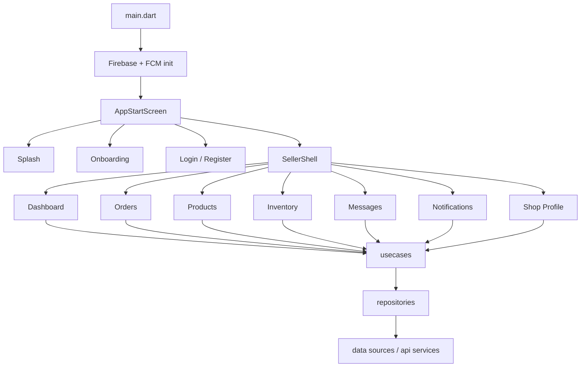

# Seller App Architecture

Blueprint cho app người bán dựa trên structure hiện tại của repo này.

## 1. Mục tiêu kiến trúc

Giữ nguyên cách tổ chức hiện tại:

- `core/` cho hạ tầng dùng chung
- `features/<feature>/data|domain|presentation` cho từng nghiệp vụ
- `Cubit/Bloc` cho state management
- `repository -> usecase -> api service` cho luồng dữ liệu

Điểm khác là chuyển từ app buyer sang seller, nên các màn chính sẽ xoay quanh quản trị đơn hàng, sản phẩm, tồn kho, báo cáo và thông báo shop.

## 2. Sơ đồ luồng tổng thể



## 3. Folder structure đề xuất

Giữ nguyên `lib/core/` và thay `lib/features/` theo hướng seller:

```text
lib/
  core/
    config/
    models/
    services/
    storage/
    theme/
    utils/
    widgets/
  features/
    app_start/
    auth/
    theme/
    notifications/
    seller_shell/
    dashboard/
    orders/
    products/
    inventory/
    customers/
    messages/
    promotions/
    shop_profile/
    settings/
```

Nếu muốn giữ structure giống hệt hiện tại, mỗi feature vẫn theo 3 lớp:

```text
features/<feature>/
  data/
    models/
    repositories/
    sources/
  domain/
    entities/
    repositories/
    usecases/
  presentation/
    bloc/
    pages/
    widgets/
```

## 4. Feature nên giữ

Các phần này dùng lại gần như nguyên vẹn hoặc chỉ chỉnh nhẹ:

- `app_start`: giữ luồng splash / onboarding / auth gate.
- `auth`: giữ đăng nhập, đăng ký, refresh token, logout.
- `theme`: giữ light/dark mode, `ThemeCubit`.
- `notifications`: giữ FCM, unread badge, notification center.
- `profile`: giữ phần hồ sơ người dùng, nhưng đổi nội dung sang seller profile hoặc shop account.
- `core/`: giữ toàn bộ hạ tầng dùng chung như token storage, notification service, theme, widgets, utils.
- `search`: giữ nếu seller cần tìm sản phẩm/đơn hàng/khách.

## 5. Feature nên thay

Các feature hiện tại thiên về buyer, nên đổi mục đích:

- `home` -> `dashboard`: thay màn trang chủ mua sắm bằng dashboard doanh số, đơn mới, trạng thái tồn kho, top sản phẩm.
- `cart` -> bỏ hoặc đổi thành `order_draft` / `packing_queue` nếu nghiệp vụ cần.
- `categories` -> `catalog` hoặc `product_categories_manage`: seller quản lý danh mục, không phải duyệt danh mục mua hàng.
- `product` -> `products`: giữ domain sản phẩm nhưng đổi UI sang CRUD, biến thể, giá, ảnh, trạng thái bán.
- `order` -> `orders`: giữ nhưng đổi trọng tâm sang xử lý đơn, xác nhận, đóng gói, vận chuyển, hoàn hàng.
- `address` -> `shop_address` hoặc gộp vào `shop_profile`: seller thường cần địa chỉ shop / kho, không phải địa chỉ giao hàng như buyer.
- `recommendation` -> bỏ: không cần gợi ý sản phẩm kiểu buyer.
- `checkout` -> bỏ: seller không checkout.
- `onboarding` -> giữ nếu cần giới thiệu tính năng seller, nhưng nội dung phải đổi.

## 6. Map từ repo hiện tại sang seller app

| Hiện tại | Seller app | Ghi chú |
|---|---|---|
| `features/home` | `features/dashboard` | Tổng quan kinh doanh |
| `features/cart` | bỏ / `packing_queue` | Không có giỏ hàng |
| `features/categories` | `features/catalog` | Quản lý danh mục |
| `features/product` | `features/products` | CRUD sản phẩm |
| `features/order` | `features/orders` | Xử lý đơn hàng |
| `features/profile` | `features/shop_profile` | Hồ sơ shop / tài khoản seller |
| `features/address` | `features/shop_address` | Nếu cần địa chỉ kho / shop |
| `features/notifications` | giữ | Thông báo đơn, chat, cảnh báo tồn kho |
| `features/search` | giữ / mở rộng | Tìm sản phẩm, đơn, khách |
| `features/auth` | giữ | Có thể thêm role seller |

## 7. Root shell nên thay

Hiện app dùng `MainScreen` với `IndexedStack` và bottom nav 4 tab. Seller app nên đổi thành shell riêng, ví dụ `SellerShell`:

- Tab 1: Dashboard
- Tab 2: Orders
- Tab 3: Products
- Tab 4: Notifications
- Tab 5: Profile / More

Nếu app có nhiều nghiệp vụ hơn, có thể chuyển sang `NavigationRail` trên tablet/web và bottom nav trên mobile.

## 8. Data flow chuẩn cho seller app

Mỗi nghiệp vụ nên đi theo chuỗi này:

1. `presentation` hiển thị UI và dispatch event/call cubit.
2. `bloc/cubit` xử lý state, loading, error, refresh.
3. `domain/usecases` chứa rule nghiệp vụ rõ ràng.
4. `domain/repositories` định nghĩa contract.
5. `data/repositories` gọi API service / remote data source.
6. `data/sources` giao tiếp HTTP, Firebase, local storage.

## 9. Thứ tự triển khai khuyến nghị

Làm theo thứ tự này để tránh vỡ kiến trúc:

1. Dựng `seller_shell` và thay `MainScreen`.
2. Giữ `app_start` + `auth`, thêm role `seller` trong token/user profile.
3. Làm `dashboard` với số liệu tổng quan giả lập hoặc API thật.
4. Làm `orders` vì đây là màn quan trọng nhất của seller.
5. Làm `products` với list, detail, create, edit, publish/unpublish.
6. Làm `inventory` nếu shop cần quản lý tồn kho theo biến thể.
7. Làm `notifications` để nhận đơn mới, hủy đơn, chat.
8. Làm `shop_profile` và `settings`.
9. Bổ sung `customers`, `messages`, `promotions` sau khi core flow ổn.

## 10. Quy ước đặt tên nên dùng

- `SellerShell`, `SellerDashboardScreen`, `OrdersCubit`, `ProductsRepositoryImpl`.
- `*_usecase.dart` cho nghiệp vụ.
- `*_repository.dart` cho contract.
- `*_repository_impl.dart` cho implementation.
- `*_remote_data_source.dart` hoặc `*_api_service.dart` cho API layer.

## 11. Gợi ý giữ codebase sạch

- Không nhồi thêm logic vào widget.
- Không để repository nuốt lỗi bằng cách trả list rỗng nếu UI cần biết lỗi thật.
- Mỗi feature nên tự chủ, chỉ dùng `core/` cho phần dùng chung.
- Nếu seller và buyer cùng codebase, nên tách theo role từ đầu để tránh màn hình và use case bị lẫn.

## 12. Kết luận ngắn

Khung hiện tại dùng rất tốt để làm seller app, chỉ cần thay lớp shell và thay các feature mua sắm bằng feature vận hành shop. Giữ `core`, `auth`, `theme`, `notifications`, `app_start`; thay `home`, `cart`, `recommendation`, `checkout`, và chỉnh `product`, `order`, `profile`, `address` sang ngữ cảnh người bán.